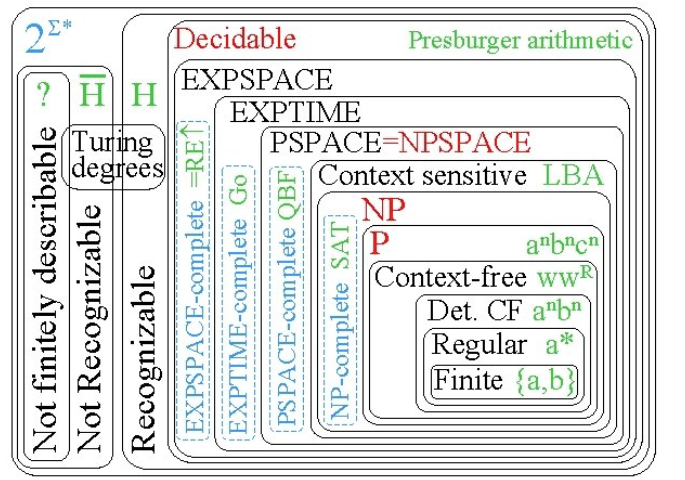

# evidencia-2-MC

# Sebastián Acosta Marín 
# A01278278

Una gramática en programación es un conjunto formal de reglas que definen cómo se pueden construir expresiones válidas dentro de un lenguaje. Estas gramáticas son fundamentales en el diseño de lenguajes de programación, ya que de esta manera se construyen lo que son los compiladores, ya que gracias a estos se puede describir de una mejro manera la sintaxis que debe seguir el código para ser comprendido y procesado correctamente por una máquina.
Un pequeño y simple ejemplo de lo que puede ser considerado como una gramatica funcional 
```bnf
oración    -> sujeto verbo objeto
sujeto     -> "Juan" | "María"
verbo      -> "come" | "lee"
objeto     -> "manzanas" | "libros"
```

Esta grámatica hacepta frases como: 
- Juan come manzanas
- Maria lee libros
- Maria come libros

Para este proyecto usare un parser para indentificar si la palabra pertenece o no pertenece a la gramatica establecida el cual es conocido como parserLL(1), el cual solo sirve para analizar lo que vienen siendo gramaticas libres de contexto. Este parser analiza las entradas de izquierda a derecha, pero para que este parser pueda funcionar se necesita que la gramatica cumpla las siguientes dos reglas:

- Que la gramatica no tenga ambigüedad
- Que la gramtica no tenga recursión hacia a izquierda

Un ejmeplo pequeño en donde existe una grámatica con ambigüedad es la siguiente:

```bnf


oración   -> oración conjunción oración | palabra

palabra   -> "llora" | "rie"
conjunción -> "y"
```

La ambigüedad se da debido a que hay más de una manera de crear la misma frase, por lo que el parser no sabe que camino tomar y falla.

La recursión hacia la izquierda se da cuando un elemento de la gramatica se llama asi mismo hasta la izquierda, lo cual provoca una recursión hacia la izquierda de manera constante.
```bnf
lista  -> lista "," elemento
        | elemento

elemento -> "a" | "b" | "c"
```
En este pequeño ejemplo la recursividad hacia la iquierda se encuentra en la siguiente linea:

```bnf
lista -> lista "," elemento
```

# Lenguaje elegido 

El lenguaje que elegí para escribir una pequeña gramatica es el "alto valyrio" el cual es el lenguaje hablado por la familia targaryen en los famosos libros de "A song of ice and fire" (el cual puede ser aprendido en la plataforma de Duolingo por cierto)

La gramatica que establecí es la siguiente:

```bnf
Dijiste:
oración        -> sujeto verbo objeto
                | sujeto verbo
                | sujeto "issi"

sujeto         -> frase_nominal

objeto         -> frase_nominal

frase_nominal  -> determinante sustantivo adjetivo frase_nominal'
                | sustantivo adjetivo frase_nominal'
                | sustantivo frase_nominal'
                | pronombre frase_nominal'

frase_nominal' -> conjunción frase_nominal 
                | ε

verbo          -> raíz_verbal sufijo_verbal

raíz_verbal    -> "jagon" | "vāedar" | "kēliar" | "rhaenagon" | "drējelagon"

sufijo_verbal  -> "i" | "is" | "ir" | "ion"

determinante   -> "ābra" | "ziry" | "bisy" | "morys" | "velg" | "līr" | "tīr"

sustantivo     -> "valzȳrys" | "zaldrīzes" | "azantys" | "qintir" | "voktys" | "melos" | "dūri" | "rhaegon"

adjetivo       -> "sȳz" | "hāedar" | "zȳhon" | "velos" | "rhaeshisar" | "zalar" | "sūngar"

pronombre      -> "nyke" | "ao" | "zȳhon" | "ses" | "til" | "ōs"

conjunción     -> "vose" | "lōr" | "se"
```

Pero el problema de esta gramatica es que cuenta tanto con ambigüedad como con recursión en la izquierda


La ambigüedad se encuentra en la siguiente linea de la gramatica:

```bnf
oración        -> sujeto verbo objeto | sujeto verbo | sujeto "issi"

sujeto         -> frase_nominal

objeto         -> frase_nominal
```
y en: 

```bnf
frase_nominal_inicial ::= determinante sustantivo adjetivo  
frase_nominal_inicial ::= sustantivo adjetivo  
frase_nominal_inicial ::= sustantivo  
```

Aqui la ambigüedad se da debido a que una secuenia de palabras que forman una oración se puede dar de diferente maneras, lo cual tambien rompería el parser, ya que este no sabría que camino tomar y se formarian más de un árbol, por lo que es por eso que existe ambigüedad dentro de la gramatica. 

# ¿Pero entonces como eliminar la ambigüedad?

Para eliminar la ambigüedad se debe elimianr eso de que se pueda llegar al mismo "destino" por medio de dos caminos diferentes, haciendo uso de lo que yo denomino camino auxiliar, el cual es un paso más que ayuda a que ya no sea ambigüo.

La solución a la ambigüedad de la producción de una oracion en donde oración tiene dos formas de crear un sujeto seguido de un verbo es la siguiente:

```bnf
oración ::= sujeto verbo oración'
oración' ::= objeto
oración' ::= ε 
```
La solución fue generar un paso auxiliar para que de esta manera no hubiera dos formas diferentes de llegar al mismo destino, haciendo asi que cada alternativa iniciara de forma única

De igual manera en la ambigüedad en la parde de frase_nominal_inicial se aplicó el mismo proceso quedando lo siguiente:
```bnf
frase_nominal_inicial ::= determinante sustantivo adjetivo
frase_nominal_inicial ::= sustantivo frase_nominal_s'

frase_nominal_s' ::= adjetivo
frase_nominal_s' ::= ε
```

Por lo que finalmente la gramatica del lenguaje quedo de la siguiente manera:

```bnf
oración ::= sujeto verbo oración'
oración' ::= objeto
oración' ::= ε

sujeto ::= frase_nominal

objeto ::= frase_nominal

frase_nominal ::= frase_nominal_inicial frase_nominal'

frase_nominal_inicial ::= determinante sustantivo adjetivo
frase_nominal_inicial ::= sustantivo frase_nominal_s'
frase_nominal_inicial ::= pronombre

frase_nominal_s' ::= adjetivo
frase_nominal_s' ::= ε

frase_nominal' ::= conjunción frase_nominal
frase_nominal' ::= ε

verbo ::= raíz_verbal sufijo_verbal

raíz_verbal ::= "jagon"
raíz_verbal ::= "vāedar"
raíz_verbal ::= "kēliar"
raíz_verbal ::= "rhaenagon"
raíz_verbal ::= "drējelagon"

sufijo_verbal ::= "i"
sufijo_verbal ::= "is"
sufijo_verbal ::= "ir"
sufijo_verbal ::= "ion"

determinante ::= "ābra"
determinante ::= "ziry"
determinante ::= "bisy"
determinante ::= "morys"
determinante ::= "velg"
determinante ::= "līr"
determinante ::= "tīr"

sustantivo ::= "valzȳrys"
sustantivo ::= "zaldrīzes"
sustantivo ::= "azantys"
sustantivo ::= "qintir"
sustantivo ::= "voktys"
sustantivo ::= "melos"
sustantivo ::= "dūri"
sustantivo ::= "rhaegon"

adjetivo ::= "sȳz"
adjetivo ::= "hāedar"
adjetivo ::= "zȳhon"
adjetivo ::= "velos"
adjetivo ::= "rhaeshisar"
adjetivo ::= "zalar"
adjetivo ::= "sūngar"

pronombre ::= "nyke"
pronombre ::= "ao"
pronombre ::= "zȳhon"
pronombre ::= "ses"
pronombre ::= "til"
pronombre ::= "ōs"

conjunción ::= "vose"
conjunción ::= "lōr"
conjunción ::= "se"

```
# Que tipo de grámatica es:

La grámatica en su forma final, es decir, una vez eliminado la recursividad hacia la izquierda y la ambigüedad pertenece al tipo de gramatica conocida como "libre de contexto" estos tipos de gramaticas no dependen de nigún contexto para poder formar cadenas. 
Según (Context Free Grammars | Brilliant Math & Science Wiki, s. f.) "Una gramática libre de contexto puede describir todos los lenguajes regulares y más, pero no todos los lenguajes posibles" 
Además una forma sencilla de indentificar una gramatica que es libre de contexto, es que del lado izquierdo de la gramatica solo cuenta con variables y con no terminales. 




# Complejidad

La complejidad del sistema es de O(n) debido al paser que se utilizo para analizar que las oraciones sean validas en la grámatica establecida.
Debido a que se elimino tanto la recursividad hacia la izquierda como la ambigüedad de la gramatica por lo que el parser puede entrar por la izquierda de la cadena e ir avanzando hacia la derecha; Por lo que se puede decir claramente que la complejidad es O(n) donde la n dependera de la longitud de la cadena que se etsa analizando. 


# Fuentes de información

Princeton (n.d.). LL(1) Parser Visualization. https://www.cs.princeton.edu/courses/archive/spring20/cos320/LL1/

Context Free Grammars | Brilliant Math & Science Wiki. (s. f.). https://brilliant.org/wiki/context-free-grammars/#:~:text=A%20context%2Dfree%20grammar%20is,%2C%20compiler%20design%2C%20and%20linguistics.

SOFTWARE DE GENERACIÓN Y SIMULACIÓN DE TABLAS DE ANÁLISIS SINTÁCTICO (BURGRAM) - An�lisis LL (1). (s. f.). http://cgosorio.es/BURGRAM/index8810.html?Los_algoritmos_de_an%E1lisis%0Asint%E1ctico:An%E1lisis_Sint%E1ctico%0ADescendente:An%E1lisis_LL_%281%29
